# Simple Map project using Typescript

- The project is created to learn and have hands-on practice on the typescript.
- Used Interfaces and classes in typescript.
- Called Google Map API to display the map
- To generate the random data, called faker API.

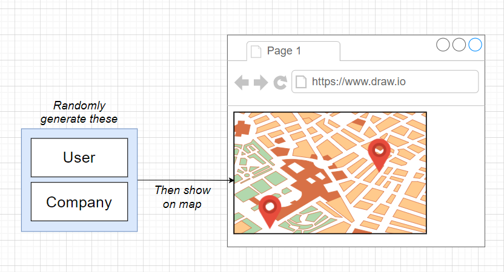

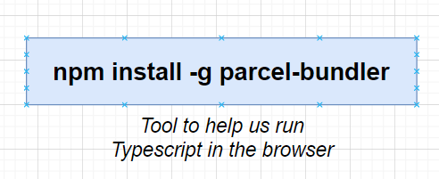

`npm install -g parcel-bundler`

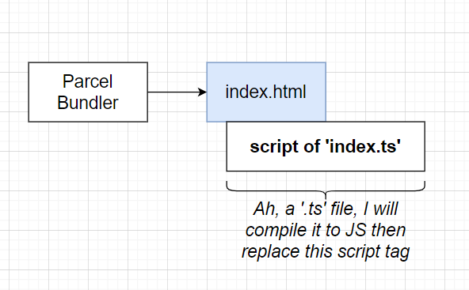

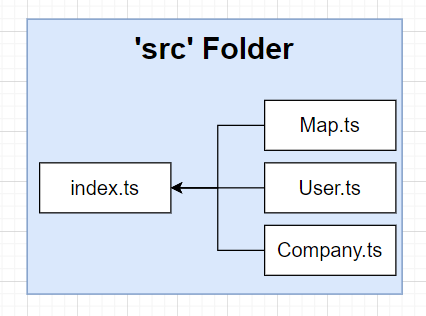

`npm install faker`

`parcel index.html`

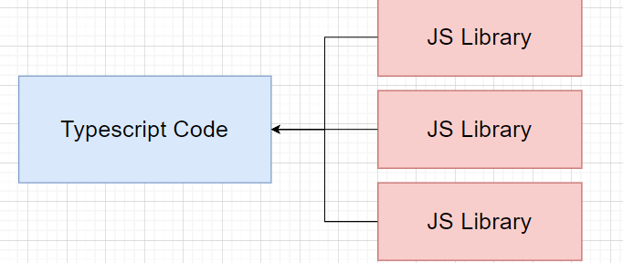

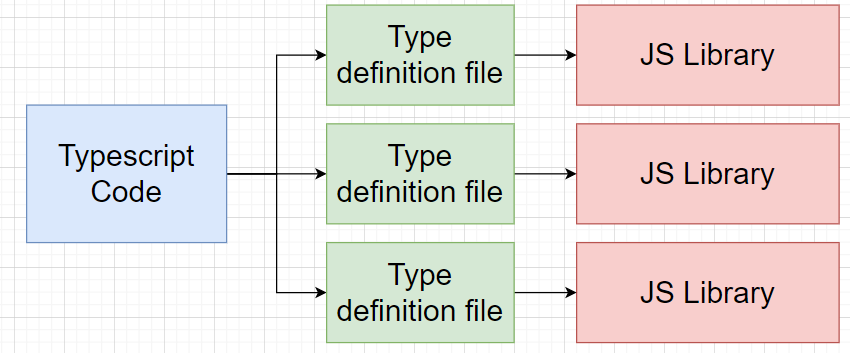

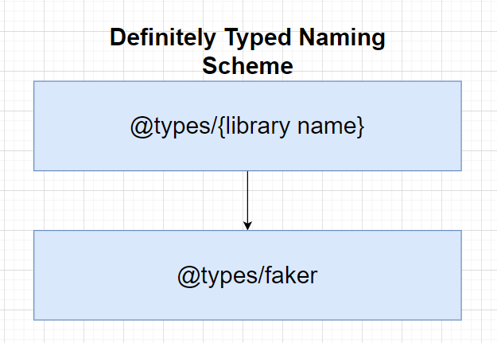

`npm install @types/faker`

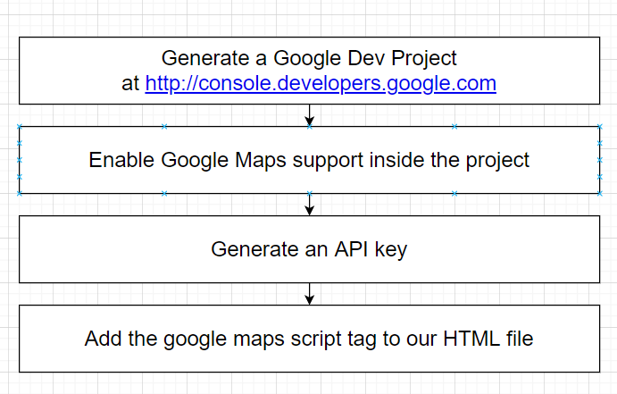

`***maps javascript API***` 

[`https://maps.googleapis.com/maps/api/js?key=`](https://maps.googleapis.com/maps/api/js?key=)

`Type definition for google map`

`npm install @types/googlemaps`

```python
class User{

name:string;
location:{
	lat: number;

	
}
}
```

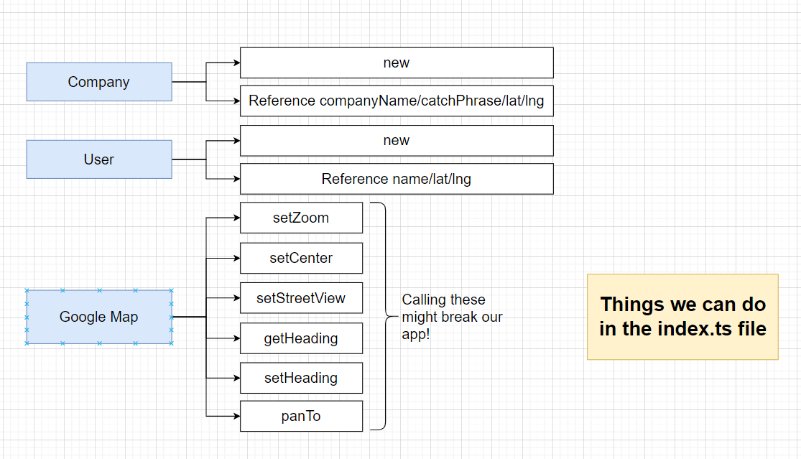

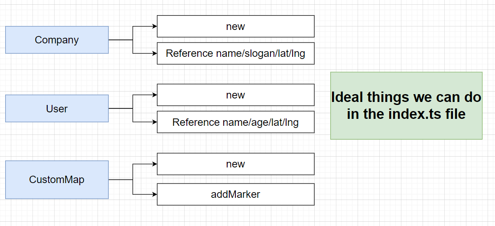

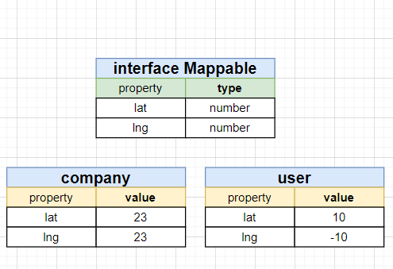

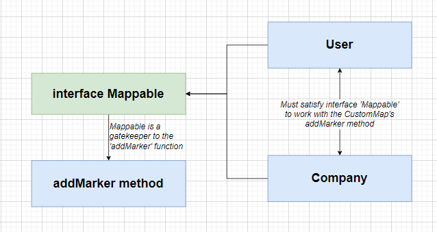

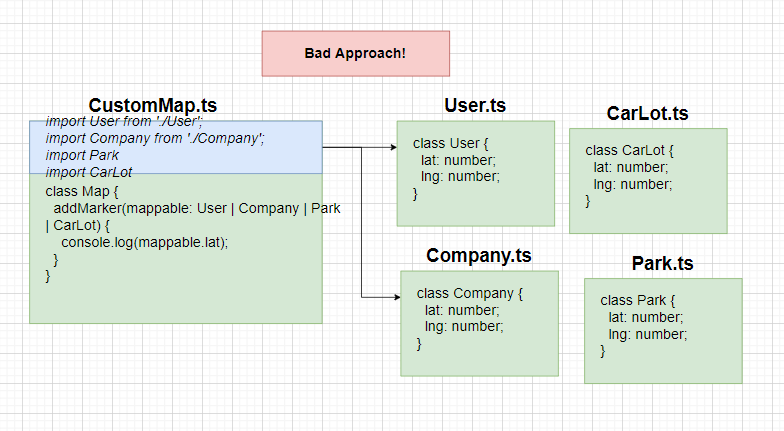

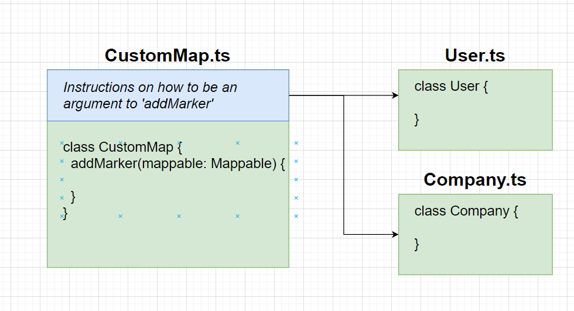

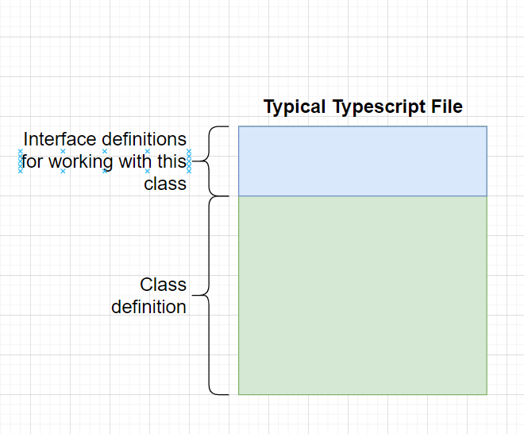

## Thank You! 🙂
